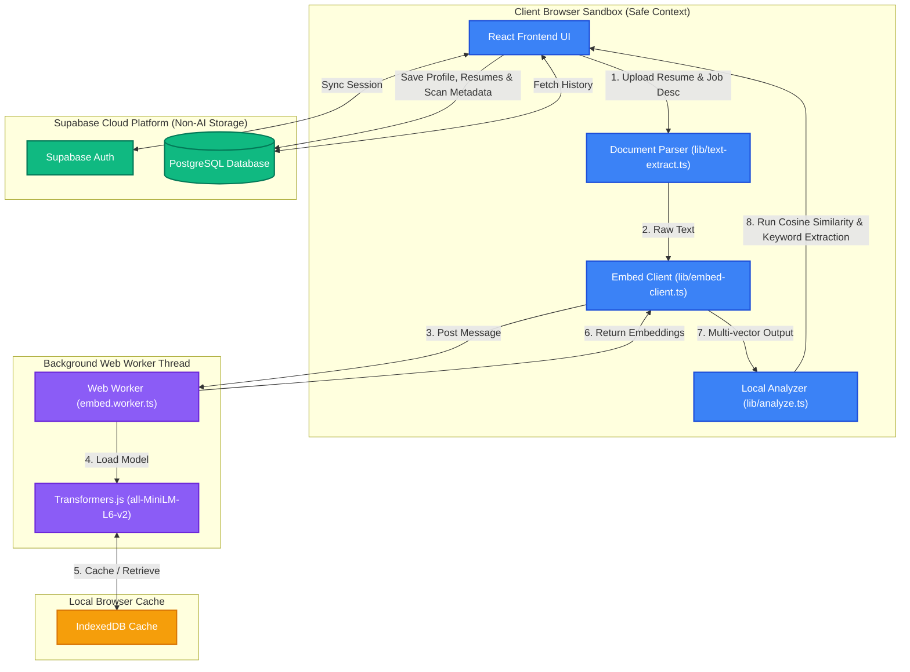

# 🎯 Resonate

<p align="center">
  <strong>Your resume never leaves your browser — the AI runs on your device, not in the cloud.</strong>
</p>

<p align="center">
  
  
  
  
  
  
</p>

---

## 📖 Table of Contents
1. [Introduction](#-introduction)
2. [How It Works (Privacy & AI Architecture)](#-how-it-works-privacy--ai-architecture)
3. [Key Features](#-key-features)
4. [Tech Stack](#-tech-stack)
5. [Database Schema](#-database-schema)
6. [Project Structure](#-project-structure)
7. [Getting Started & Local Setup](#-getting-started--local-setup)
8. [Frequently Asked Questions (FAQ)](#-frequently-asked-questions-faq)
9. [Privacy & Security Commitment](#-privacy--security-commitment)

---

## 🌟 Introduction

**Resonate** is a privacy-first, serverless-AI resume-to-job-description matcher designed to put the user back in control of their data. 

Applying for jobs shouldn't mean sharing your professional history and contact details with third-party LLMs or remote APIs. Resonate solves this by loading a compact machine learning model directly in your browser. Paste your resume and a target job description, and Resonate immediately computes their semantic alignment, runs a keyword gap analysis, detects ATS formatting issues, and suggests actionable resume updates — **entirely offline, with 0% data sent to external AI servers**.

Supabase is only leveraged for non-AI workflows: secure user authentication, managing different versions of your resumes, and keeping track of your match-score history to visualize your profile optimizations over time.

---

## 🧠 How It Works (Privacy & AI Architecture)

Resonate uses [Transformers.js](https://huggingface.co/docs/transformers.js) to run the **`all-MiniLM-L6-v2`** sentence-transformer model locally on your machine. 

### 🔄 The Embedding and Scoring Pipeline
1. **Background Model Fetching**: The first time you initiate a scan, the ~90MB model is fetched from Hugging Face's CDN and cached locally in your browser's **IndexedDB** database. Subsequent scans load instantly from the local cache.
2. **Off-Thread Processing**: To prevent UI freezes and maintain a responsive 60fps experience, embedding generation is completely offloaded to a browser **Web Worker** (`embed.worker.ts`).
3. **High-Dimensional Vector Representation**: Your resume and job description are converted into 384-dimensional dense vectors representing their semantic meaning.
4. **Cosine Similarity Computation**: The client calculates the cosine similarity between the resume vector and the job description vector to generate an overall match score from `0` to `100`.
5. **Section Grading**: The resume is parsed into sections (Skills, Experience, Projects), and each is separately compared to the job description vector to isolate which sections need the most alignment work.

### 📐 Local Architecture Workflow



---

## ✨ Key Features

* 🔒 **100% Client-Side AI**: Your document contents never travel to OpenAI, Anthropic, or any server. Everything is processed locally in the browser sandboxed memory.
* 🤖 **MiniLM Semantic Embeddings**: Utilizes the battle-tested `all-MiniLM-L6-v2` model to capture context and meaning, matching concepts even when exact phrasing differs.
* ⚡ **Off-Main-Thread Processing**: Leverages Web Workers to perform heavy vector math without blocking user interactions.
* 🔍 **Keyword Gap Spotter**: Extracts the most critical skills and terms from the job description and performs a local crosscheck to reveal what's missing.
* 📊 **Multi-Version Tracking**: Save multiple resumes (e.g., *Frontend-focused*, *Management-focused*) to Supabase and compare their fit scores against the same job listing.
* 📈 **Improvement Analytics**: Track your progress historically. Witness your match score climb as you refine your bullet points.
* 📄 **Local ATS Checks**: Analyzes document structure to identify issues like missing sections, poor phone number formats, or generic file headers before you submit them.

---

## 🛠️ Tech Stack

| Layer | Technology | Details |
| :--- | :--- | :--- |
| **Core Framework** | React 19 + TypeScript | High performance, type-safe frontend |
| **Routing & Server**| TanStack Start | Modern file-based routing and page shell transitions |
| **Styling** | Tailwind CSS | Sleek, glassmorphism-friendly, dark-mode design |
| **Build System** | Vite 8 + Bun | Hyper-fast local bundling and dependency management |
| **On-Device AI** | Transformers.js (`@xenova/transformers`) | Porting PyTorch/ONNX models directly to web environments |
| **Model** | `Xenova/all-MiniLM-L6-v2` | Dense vector encoder (384 Dimensions, ~90MB ONNX format) |
| **Data & Auth** | Supabase | Auth, PostgreSQL database, row-level security (RLS) policies |

---

## 🗄️ Database Schema

Supabase manages a standard PostgreSQL database containing three main user-related tables. All database actions require authentication, and custom Row-Level Security (RLS) rules restrict data access exclusively to the creator.

```
                  ┌──────────────────────┐
                  │   auth.users (Core)  │
                  └──────────┬───────────┘
                             │
                             ▼ (1-to-1)
                  ┌──────────────────────┐
                  │    public.profiles   │
                  └──────────┬───────────┘
                             │
            ┌────────────────┴────────────────┐
            │ (1-to-many)                     │ (1-to-many)
            ▼                                 ▼
┌──────────────────────┐            ┌──────────────────────┐
│    public.resumes    │◄───────────┤     public.scans     │
└──────────────────────┘ (1-to-many)└──────────────────────┘
```

### 1. `public.profiles`
Stores user profile information. Automatically populated via database triggers on user signup.
* `id` (`UUID`, Primary Key) -> References `auth.users.id`
* `display_name` (`TEXT`)
* `created_at` (`TIMESTAMPTZ`)

### 2. `public.resumes`
Stores saved resumes.
* `id` (`UUID`, Primary Key)
* `user_id` (`UUID`) -> References `auth.users.id`
* `name` (`TEXT`) -> Friendly label for this version (e.g. `Backend Senior v3`)
* `content` (`TEXT`) -> Plain text resume contents
* `created_at` / `updated_at` (`TIMESTAMPTZ`)

### 3. `public.scans`
Stores matching results and metadata metrics. **Notice: This stores the text and final match analytics, but no external AI calls are ever made.**
* `id` (`UUID`, Primary Key)
* `user_id` (`UUID`) -> References `auth.users.id`
* `resume_id` (`UUID`, Nullable) -> References `public.resumes.id`
* `resume_name` (`TEXT`)
* `resume_text` (`TEXT`)
* `jd_text` (`TEXT`)
* `jd_title` (`TEXT`)
* `match_score` (`NUMERIC`) -> The final cosine similarity score (scaled to 0-100)
* `matched_keywords` (`JSONB`) -> Array of matching skills/terms
* `missing_keywords` (`JSONB`) -> Array of missing skills/terms
* `section_scores` (`JSONB`) -> Key-value pairs of section scores (Skills, Experience, Projects)
* `suggestions` (`JSONB`) -> List of actionable improvement recommendations
* `ats_issues` (`JSONB`) -> ATS formatting issues detected locally
* `created_at` (`TIMESTAMPTZ`)

---

## 📂 Project Structure

```bash
resumematch-ai/
├── supabase/                  # Supabase migrations and configurations
│   ├── config.toml
│   └── migrations/            # Database schema migration files
├── src/
│   ├── components/            # Reusable UI components
│   │   ├── ui/                # Radix UI and raw layout component primitives
│   │   ├── file-drop.tsx      # Local PDF/text file dropzone handler
│   │   ├── score-ring.tsx     # Visual similarity match score gauge
│   │   ├── keyword-chips.tsx  # Display chip grid for matched vs missing keywords
│   │   └── privacy-badge.tsx  # Green status light signaling on-device operation
│   ├── hooks/                 # Custom React hooks
│   ├── integrations/          # Supabase client setup
│   ├── lib/                   # Utility helpers and analysis logic
│   │   ├── analyze.ts         # Main client analyzer and scoring logic
│   │   ├── embed-client.ts    # Web Worker messenger & cosine similarity math
│   │   ├── keywords.ts        # Keyword extraction engine
│   │   ├── ats.ts             # Rule-based local ATS checker
│   │   └── text-extract.ts    # Extracts text content from uploads
│   ├── routes/                # TanStack Start File-based routes
│   │   ├── _authenticated/    # Authentication-protected subpages
│   │   │   ├── compare.tsx    # Resume version comparison
│   │   │   ├── dashboard.tsx  # History logs, charts, and progress overview
│   │   │   ├── resumes.tsx    # Saved resume version management
│   │   │   └── history.tsx    # Scrollable past scan lists
│   │   ├── auth.tsx           # Signup and Sign-in portal
│   │   ├── index.tsx          # Landing overview and hero sections
│   │   └── scan.tsx           # Interactive analyzer interface
│   ├── workers/
│   │   └── embed.worker.ts    # Web Worker running the local AI model
│   ├── styles.css             # Base CSS and theme configurations
│   ├── main.tsx
│   └── routeTree.gen.ts       # Autogenerated TanStack router paths
├── package.json
└── tsconfig.json
```

---

## 🚀 Getting Started & Local Setup

Resonate is built to be extremely lightweight to run locally. Since it uses **Bun**, you can get it up and running in seconds.

### Prerequisites
Make sure you have [Bun](https://bun.sh/) (recommended) or [Node.js](https://nodejs.org/) installed.

### 1. Clone the repository
```bash
git clone https://github.com/yourusername/resumematch-ai.git
cd resumematch-ai
```

### 2. Install dependencies
```bash
bun install
# Or if using npm:
# npm install
```

### 3. Setup environment variables
Create a `.env` file in the root directory. You can copy the template from `.env.example`:
```bash
cp .env.example .env
```
Fill in your Supabase credentials:
```env
VITE_SUPABASE_URL="https://your-project.supabase.co"
VITE_SUPABASE_PUBLISHABLE_KEY="your-anon-publishable-key"
```

### 4. Start the local server
Run the development environment locally:
```bash
bun run dev
# Or if using npm:
# npm run dev
```

Open [http://localhost:3000](http://localhost:3000) (or the port specified in terminal) in your browser.

### 5. Build for production
To compile the production assets:
```bash
bun run build
# Or if using npm:
# npm run build
```

---

## ❓ Frequently Asked Questions (FAQ)

#### Q: How does the AI run in the browser without an API key?
**A:** Thanks to WebAssembly and ONNX Runtime Web, modern browsers are capable of running neural networks. Transformers.js loads the ONNX version of `all-MiniLM-L6-v2`, compiles it to run inside a sandboxed Web Worker, and processes your text inputs using the client device's CPU/GPU.

#### Q: Does it work offline?
**A:** Yes! Once the model has been downloaded the first time (approx. 90MB) and cached in your browser's IndexedDB, you can run scans, calculate match scores, and do gap analyses entirely without an active internet connection.

#### Q: Does my resume text get saved to Supabase?
**A:** Only if you are logged in and choose to save a resume version or record a scan result to your dashboard history. If you use the app in guest/anonymous mode, everything is processed solely in transient memory and deleted when you close the tab.

#### Q: What is the `all-MiniLM-L6-v2` model?
**A:** It is a highly optimized sentence-transformers model that maps sentences and paragraphs to a 384-dimensional dense vector space. It is specifically pre-trained for tasks like semantic search, clustering, and sentence similarity matching.

---

## 🛡️ Privacy & Security Commitment

Your professional data is highly personal. Resonate guarantees:
1. **Zero External AI Servers**: No API calls are made to OpenAI, Anthropic, Google, or any LLM provider.
2. **Local Sandboxing**: All text extraction, embedding, vector matching, and ATS checks are performed inside your browser sandbox.
3. **Transparent Data Syncing**: Database operations (through Supabase) only sync data to your personal account database. You retain full ownership, with the ability to delete your data or your account at any time.

---

<p align="center">
  Made with 🔒 for private, secure, and fast resume matching.
</p>
